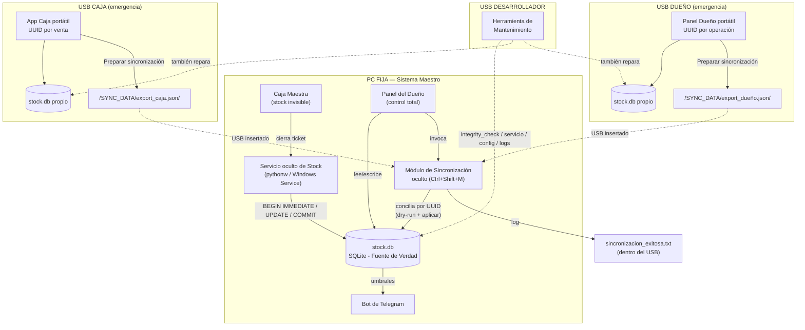

# Sistema Dual de Caja y Stock con Módulos Portátiles de Emergencia

Monorepo Python que compila a 5 ejecutables Windows portables:
**Maestro Caja**, **Maestro Dueño**, **USB Caja**, **USB Dueño**, **USB Mantenimiento (Dev)**.

---

## 1. Análisis de Riesgos (pre-codificación)

**1. Concurrencia sobre el stock.** SQLite no soporta `SELECT ... FOR UPDATE`. Se resolvió con
**versionado optimista**: cada fila de `Productos` tiene una columna `version`; todo `UPDATE` de
stock lleva `WHERE id = ? AND version = ?`, y si el `rowcount` da 0 (alguien más escribió primero)
se reintenta la transacción completa hasta 5 veces (`pos_core/stock_service.py::_con_reintento_optimista`).
Cada movimiento se envuelve además en `BEGIN IMMEDIATE ... COMMIT/ROLLBACK`
(`pos_core/db.py::transaction`), así que un corte de luz a mitad de camino nunca deja stock
"descontado a medias": o se aplicó completo, o no se aplicó nada.

**2. Parsing de PDFs con formato variable.** No existe "el" formato de factura de un proveedor.
En vez de un único regex frágil, `pos_core/pdf_import.py` prueba **tablas estructuradas primero**
(`pdfplumber.extract_tables`) y cae a **una batería de patrones de línea** sobre el texto plano.
Todo lo que no matchea ningún patrón se junta en `lineas_no_reconocidas` — nunca se descarta en
silencio — para carga manual asistida. Si el PDF no tiene texto extraíble (imagen escaneada), se
marca `es_pdf_escaneado=True` y se avisa al usuario en vez de fallar silenciosamente.

**3. Sincronización por UUID entre 3 bases de datos independientes.** El id autoincremental de
SQLite es local a cada archivo `.db`: el Maestro, el USB Caja y el USB Dueño pueden tener los tres
un registro con `id=57` que no tiene nada que ver entre sí. Toda entidad que puede nacer en un USB
(`Ventas`, `Movimientos_Stock`, `Productos`) lleva un `uuid_unico TEXT UNIQUE` generado con
`uuid.uuid4()` en el momento de creación, y **ese** es el que viaja en los JSON de sincronización y
el que usa la conciliación para detectar duplicados. Ver sección 10 para el detalle completo.

---

## 2. Diagrama de Arquitectura



---

## 3. Estructura de Carpetas

**Repositorio (fuente):**
```
/
├── sql/schema.sql                  # DDL único, compartido por los 3 tipos de DB
├── pos_core/                       # Lógica de negocio pura (sin UI), importada por todo
│   ├── db.py                       # conexión + transaction() con BEGIN IMMEDIATE
│   ├── paths.py                    # get_base_path() portable
│   ├── stock_service.py            # único punto de escritura de stock
│   ├── sales.py                    # cerrar_ticket()
│   ├── bulk_edit.py                # edición masiva + redondeo a centena superior
│   ├── pdf_import.py               # parsing de facturas
│   ├── excel_import.py             # carga masiva inicial
│   ├── filters.py                  # filtros anidados guardables
│   ├── sync_export.py              # export_caja() / export_dueno() (USBs)
│   ├── reconciliation.py           # conciliación por UUID (solo Maestro)
│   ├── telegram_bot.py             # alertas de stoploss/sobre-stock
│   └── config.py                   # config.ini portable
├── apps/
│   ├── master_caja/main.py
│   ├── master_dueno/main.py + panel_sync.py   (oculto, Ctrl+Shift+M)
│   ├── usb_caja/main.py
│   ├── usb_dueno/main.py           # reutiliza master_dueno + banner + export
│   └── usb_dev/mantenimiento.py
├── services/
│   ├── stock_daemon_windows.py     # watchdog, corre con pythonw.exe
│   └── stock_windows_service.py    # registro como Servicio de Windows (pywin32)
├── scripts/setup_inicial.py        # primer arranque de una DB
└── build/build_all.bat             # PyInstaller x5
```

**PC Fija (post-instalación):**
```
C:\SistemaDual\
├── MaestroCaja\MaestroCaja.exe
├── MaestroDueno\MaestroDueno.exe
├── StockService\StockService.exe   (instalado como servicio de Windows)
├── database\stock.db               # UNA sola DB compartida por Caja y Dueño
├── config.ini
└── logs\
```

**Cada USB de emergencia (Caja / Dueño):**
```
E:\  (la letra es indistinta, todo es relativo a __file__)
├── USB_Caja.exe  (o USB_Dueno.exe)
├── database\stock.db               # DB propia del USB, independiente de la del Maestro
├── SYNC_DATA\
│   ├── export_caja.json            # (o export_dueño.json) — el "latest"
│   └── export_caja_20260824_...json  # histórico con timestamp
├── config.ini
└── sincronizacion_exitosa.txt      # lo escribe el Maestro al conciliar
```

**USB del Desarrollador:**
```
F:\
├── USB_Mantenimiento.exe
├── config_espejo\config.ini        # copia de referencia para restaurar
├── espejo_apps\                    # copia "conocida buena" de cada app, generada
│   ├── MaestroCaja\, MaestroDueno\, StockService\, USB_Caja\, USB_Dueno\
│   │                                # por build_all.bat a partir del ultimo build;
│   │                                # contra esto se comparan y reponen archivos
│   │                                # danados/faltantes de cualquier instalacion
└── reporte_mantenimiento.txt       # se va acumulando (se archiva solo al superar 2 MB)
```

---

## 4. Modelo de Datos

Ver **`sql/schema.sql`** (archivo completo en el repo). Resumen de las tablas pedidas — todas con
`uuid_unico TEXT UNIQUE` donde el registro puede originarse en un USB, y `sincronizado BOOLEAN`
para saber qué falta exportar:

- **Productos**: `codigo` (clave natural/EAN), `precio_venta`, `stock`, `version` (versionado
  optimista), `stock_minimo`/`stock_maximo` (umbrales de alerta), `origen`, `sincronizado`.
- **Movimientos_Stock**: `uuid_unico`, `producto_codigo` (no `producto_id` — ver sección 10),
  `tipo` (`ENTRADA_MANUAL|ENTRADA_PDF|ENTRADA_EXCEL|SALIDA_MANUAL|SALIDA_VENTA|AJUSTE_BULK`),
  `stock_resultante` (auditoría), `ticket_uuid`, `origen`, `sincronizado`.
- **Ventas**: `uuid_unico` (generado al cobrar), `fecha_hora` (original, no la de importación),
  `total`, `metodo_pago`, `origen`, `sincronizado`, `importado_en`.
- **Detalle_Ventas**: `venta_uuid` (FK lógica), `producto_codigo` + `producto_nombre` +
  `precio_unitario` como **snapshot histórico** (si el precio cambia después, el ticket viejo no
  se altera).
- **Configuracion_Alertas**: `producto_codigo` (NULL = umbral global), `stock_minimo`,
  `stock_maximo`, `telegram_chat_id`, `ultima_alerta_enviada` (cooldown anti-spam).
- **Filtros_Guardados**: `nombre`, `definicion_json` (árbol AND/OR).
- *(extra, no pedida explícitamente pero necesaria)* **Log_Sincronizacion**: trazabilidad de cada
  conciliación aplicada, espejo en DB del `.txt` que se deja en el USB.

---

## 5. Servicio Oculto del Maestro

`services/stock_daemon_windows.py` corre con `pythonw.exe` (sin ventana) y actúa como *watchdog*
de refuerzo: el descuento real ya ocurre dentro de `pos_core/sales.py::cerrar_ticket()` en la misma
operación que graba el ticket, pero el demonio revisa cada 5s si quedó alguna línea de venta sin su
movimiento `SALIDA_VENTA` correspondiente (por ejemplo, corte de luz justo entre el `INSERT` de la
venta y el descuento) y la reintenta:

```python
def _ventas_con_stock_pendiente():
    conn = get_connection()
    return conn.execute("""
        SELECT dv.venta_uuid, dv.producto_codigo, dv.cantidad, v.usuario
        FROM Detalle_Ventas dv
        JOIN Ventas v ON v.uuid_unico = dv.venta_uuid
        WHERE v.anulada = 0
          AND NOT EXISTS (
              SELECT 1 FROM Movimientos_Stock ms
              WHERE ms.ticket_uuid = dv.venta_uuid AND ms.producto_codigo = dv.producto_codigo
          )
    """).fetchall()

def ciclo_watchdog():
    for p in _ventas_con_stock_pendiente():
        stock_service.descontar_por_venta(
            p["producto_codigo"], p["cantidad"],
            ticket_uuid=p["venta_uuid"], usuario=p["usuario"], origen="MAESTRO")
```

Para producción se registra como Servicio de Windows real con `services/stock_windows_service.py`
(pywin32), que arranca con el sistema operativo sin necesidad de sesión de usuario logueada.

---

## 6. Rutas Relativas Portables

```python
# pos_core/paths.py
def get_base_path() -> str:
    if getattr(sys, "frozen", False):          # PyInstaller
        return os.path.dirname(os.path.abspath(sys.executable))
    return os.path.dirname(os.path.abspath(sys.argv[0]))

def db_path(filename: str = "stock.db") -> str:
    return os.path.join(ensure_dir(os.path.join(get_base_path(), "database")), filename)
```

Todo (`database/`, `SYNC_DATA/`, `logs/`, `config.ini`) cuelga de `get_base_path()`, nunca de una
letra de unidad fija. El mismo USB funciona insertado como `E:`, `F:` o `G:`.

---

## 7. Exportación/Importación JSON y Conciliación

**Export (USB) — `pos_core/sync_export.py`:** selecciona todo lo que tiene `sincronizado = 0`,
escribe el JSON, y **recién después** de escribirlo con éxito marca esos registros como
sincronizados dentro de la misma transacción — así, si el archivo nunca llega a aplicarse en el
Maestro, una futura exportación los vuelve a incluir en vez de perderlos.

**Conciliación (Maestro) — `pos_core/reconciliation.py`:**

```python
def aplicar_export_caja(ruta_json: str, *, usuario_dev: str) -> ResumenConciliacion:
    data = _leer_json(ruta_json)
    for venta in data["ventas"]:
        with transaction() as conn:
            if _venta_existe(conn, venta["uuid_unico"]):
                resumen.ventas_omitidas_duplicadas += 1
                continue
            conn.execute("INSERT INTO Ventas (uuid_unico, fecha_hora, total, ...) VALUES (...)")
            # + detalle de líneas, con la fecha_hora ORIGINAL del USB
    for mov in data["movimientos_stock"]:
        if not _movimiento_existe(conn, mov["uuid_unico"]):
            delta = -mov["cantidad"] if mov["tipo"].startswith("SALIDA") else mov["cantidad"]
            _aplicar_movimiento_reproducido(mov, delta, usuario_dev)  # reproduce el DELTA, no un valor absoluto
```

Antes de aplicar, `analizar_export_*()` hace el mismo recorrido en modo lectura y arma el
`ResumenConciliacion` que el panel oculto (`apps/master_dueno/panel_sync.py`, Ctrl+Shift+M)
muestra para que el desarrollador confirme, y al aplicar se escribe tanto en
`Log_Sincronizacion` (DB) como en `sincronizacion_exitosa.txt` (dentro del propio USB).

---

## 8. Edición Masiva — Redondeo a Centena Superior

```python
# pos_core/bulk_edit.py
def redondear_a_centena_superior(valor: float) -> int:
    return int(math.ceil(valor / 100.0) * 100)

def calcular_nuevo_precio(precio_actual, *, porcentaje=None, monto_fijo=None, redondear=True):
    nuevo = precio_actual * (1 + porcentaje / 100.0) if porcentaje is not None else precio_actual + monto_fijo
    return redondear_a_centena_superior(nuevo) if redondear else round(nuevo, 2)
```

Verificado: `calcular_nuevo_precio(2500, porcentaje=3)` → `2575` → **`2600`** (test automatizado,
ver sección de pruebas más abajo). Soporta también `monto_fijo` positivo/negativo y porcentajes
negativos, cada producto en su propia transacción para no bloquear el resto de la tabla.

---

## 9. Parsing de PDF

Ver `pos_core/pdf_import.py` completo en el repo. Extracto del criterio de robustez:

```python
_PATRONES = [
    re.compile(r"^(?P<codigo>\d{6,14})\s+(?P<nombre>.+?)\s+x?(?P<cantidad>\d+)\s+\$?\s*(?P<precio>[\d.,]+)\s*$"),
    re.compile(r"^(?P<codigo>[A-Za-z0-9\-]+)\s*\|\s*(?P<nombre>.+?)\s*\|\s*(?P<cantidad>\d+)\s*\|\s*(?P<precio>[\d.,]+)\s*$"),
    re.compile(r"^(?P<codigo>[A-Za-z0-9\-]+)\s+(?P<nombre>.+?)\s+Cant:\s*(?P<cantidad>\d+)\s+P\.?\s*Unit:?\s*\$?\s*(?P<precio>[\d.,]+)\s*$", re.IGNORECASE),
]
```

Con `pdfplumber.extract_tables()` probado primero, texto plano como fallback, normalización de
números `es-AR` (`3.500,00`) vs `en-US` (`3500.00`), y detección de PDF escaneado sin texto.

---

## 10. Bot de Telegram

```python
# pos_core/telegram_bot.py
def revisar_umbrales_y_alertar():
    for row in _productos_fuera_de_umbral():
        if row["stock"] <= row["stock_minimo"]:
            alerta = f"⚠️ ALERTA STOCK BAJO: '{row['nombre']}' tiene solo {row['stock']} unidades"
        elif row["stock_maximo"] and row["stock"] >= row["stock_maximo"]:
            alerta = f"📦 ALERTA SOBRE-STOCK: '{row['nombre']}' tiene {row['stock']} unidades"
        else:
            continue
        if _fuera_de_cooldown(row) and enviar_mensaje(alerta, chat_id=row["chat_id"]):
            _marcar_alerta_enviada(row["codigo"])
```

Corre en `MonitorAlertas(threading.Thread)`, cooldown de 4h por producto para no spamear, y
`enviar_mensaje()` atrapa `requests.RequestException` — sin internet, simplemente no manda nada,
pero **nunca** rompe el resto del sistema (cobrar/descontar stock sigue 100% offline).

---

## 11. Compilación (PyInstaller)

Ver **`build/build_all.bat`** completo. Resumen de los comandos:

```bat
set PYI=pyinstaller --noconfirm --clean --onedir --windowed
set DATA=--add-data "sql\schema.sql;sql"

%PYI% %DATA% --name MaestroCaja  --paths . apps\master_caja\main.py
%PYI% %DATA% --name MaestroDueno --paths . --hidden-import matplotlib.backends.backend_tkagg apps\master_dueno\main.py
%PYI% %DATA% --name USB_Caja     --paths . apps\usb_caja\main.py
%PYI% %DATA% --name USB_Dueno    --paths . --hidden-import matplotlib.backends.backend_tkagg apps\usb_dueno\main.py
%PYI% %DATA% --name USB_Mantenimiento --paths . apps\usb_dev\mantenimiento.py

pyinstaller --noconfirm --clean --onedir --noconsole %DATA% --name StockService --paths . ^
    --hidden-import win32timezone services\stock_windows_service.py
```

`--onedir` (no `--onefile`): así los USBs quedan con estructura de carpetas navegable y el arranque
es más rápido (no hay que descomprimir en cada ejecución). `--windowed` = sin consola visible.
`--add-data "sql\schema.sql;sql"` embebe el DDL dentro del propio `.exe`, así el primer arranque en
cualquier PC puede crear la base sin depender de un archivo externo.

---

## 12. Instrucciones Paso a Paso

**A) Primera vez (en desarrollo, para probar):**
```bash
pip install -r requirements.txt
python scripts/setup_inicial.py        # crea database/stock.db + usuario 'dueño'
python apps/master_dueno/main.py       # cargar Excel inicial / productos
python apps/master_caja/main.py        # ya se puede cobrar
```

**B) Instalación real en la PC fija del local:**
1. `build\build_all.bat` (requiere Windows + Python + `pip install -r requirements.txt`).
2. Copiar `dist\MaestroCaja\`, `dist\MaestroDueno\` y `dist\StockService\` a `C:\SistemaDual\`.
3. Ejecutar una vez `MaestroDueno.exe` (o `scripts\setup_inicial.py`) para crear `database\stock.db`
   y cargar el Excel inicial de productos (pestaña "Carga Excel").
4. Instalar el servicio oculto: `StockService.exe install` y luego `StockService.exe start`
   (o `sc create SistemaDualStockService binPath= "...\StockService.exe"` + `sc start`).
5. Configurar el bot de Telegram desde `MaestroDueno.exe` → pestaña "Alertas Telegram" (token +
   chat id, obtenidos de @BotFather).
6. Crear accesos directos de `MaestroCaja.exe` para el cajero (sin ver la carpeta `database\`).

**C) Preparar los USBs de emergencia:**
1. Copiar `dist\USB_Caja\` completo a la raíz de un pendrive, y `dist\USB_Dueno\` a otro (o al
   mismo, en carpetas separadas).
2. Ejecutar cada uno una vez para que se cree su propio `database\stock.db` vacío.
3. **Importante:** cargar en cada USB una copia actualizada de los productos (vía Excel) para que
   el cajero de emergencia pueda buscar y cobrar productos reales.

**D) Uso en emergencia (PC fija caída):**
1. Insertar el USB Caja en cualquier PC con Windows 10/11 (no requiere instalar nada).
2. Ejecutar `USB_Caja.exe` y cobrar normalmente — el cartel rojo recuerda que es modo offline.
3. Al finalizar el día (o antes de sacar el USB), tocar **"Preparar sincronización"**.
4. Repetir con el USB Dueño si hubo movimientos de stock/precios/facturas durante la emergencia.

**E) Reconciliar cuando la PC fija vuelve a andar:**
1. Insertar el/los USB en la PC fija (o llevarlos a la del desarrollador).
2. En `MaestroDueno.exe`, presionar **Ctrl+Shift+M**.
3. "Buscar USBs conectados" detecta automáticamente las carpetas `SYNC_DATA\` en las unidades
   montadas; revisar el resumen de diferencias (ventas nuevas, duplicados omitidos, conflictos de
   precio) y presionar **"Aplicar cambios"**.
4. Verificar `sincronizacion_exitosa.txt` dentro del USB como constancia.

**F) Mantenimiento urgente (USB del desarrollador):**
1. Insertar el USB de mantenimiento, ejecutar `USB_Mantenimiento.exe`.
2. Tocar **"REPARAR TODO AUTOMÁTICAMENTE"**: detecta solo el Maestro (`C:\SistemaDual`) y
   cualquier USB de emergencia conectado, sin elegir ninguna carpeta a mano, y en cada uno
   corre: espacio en disco, integridad de la base (con backup + reparación .dump/.restore, y
   si ni eso alcanza, restauración del backup más reciente disponible), migración de estructura
   (agrega columnas/tablas nuevas que una versión vieja no tenía, sin perder datos), corrección
   de inconsistencias de datos (p.ej. stock negativo, con su movimiento de auditoría), servicio
   de Windows (lo reinstala si no está registrado), `config.ini`, logs viejos, y reposición de
   archivos del programa dañados/faltantes contra `espejo_apps\` (la copia de referencia que el
   propio USB lleva encima desde el último `build_all.bat`) — esto último es lo que permite que
   un bug de código ya corregido se resuelva con solo conectar este USB, siempre que se lo haya
   reconstruido después de aplicar el arreglo.
3. La opción "Avanzado: reparar una única carpeta a mano" sigue disponible para una instalación
   en una ruta no estándar que la detección automática no encuentre.
4. Informe final en pantalla y en `reporte_mantenimiento.txt` (se archiva solo al superar 2 MB):
   todo lo que se corrigió y todo lo que no se pudo resolver solo queda registrado, nunca en
   silencio.

---

## Proceso de pensamiento — respuestas puntuales pedidas en el prompt

**¿Cómo se evita que el historial del USB choque con el id autoincremental del Maestro?**
No se usa el `id` para nada entre bases: cada `Venta` y cada `Movimiento_Stock` nace con un
`uuid_unico` (UUID4) en el momento de crearse, y `Detalle_Ventas`/`Movimientos_Stock` referencian
al producto por su **`codigo`** (clave natural/EAN), no por `producto_id`. Al conciliar, el Maestro
inserta la venta con un **nuevo** `id` autoincremental propio (el que le toque en esa tabla), pero
conserva el `uuid_unico` original — que es lo único que se compara para decidir si ya existe.

**¿Qué pasa si el dueño cambia un precio en su USB mientras la caja fija vende con el precio
viejo?** No es un conflicto real: son eventos independientes con timestamp propio. La venta ya se
cobró con el precio vigente en ese momento — `Detalle_Ventas.precio_unitario` es un **snapshot**
histórico, así que ese ticket nunca se toca. El cambio de precio del USB se concilia por separado
comparando `actualizado_en`: si es más reciente que el del Maestro, gana y actualiza
`Productos.precio_venta` **hacia adelante** (afecta la próxima venta, no la ya hecha). El panel de
conciliación muestra explícitamente esos casos en `conflictos_precio` antes de aplicarlos.

**¿Qué pasa si el cliente saca el USB sin exportar y se pierden las ventas del día?** No se
pierden: la DB completa vive dentro del USB (`database\stock.db`), no solo el JSON de
sincronización. "Preparar sincronización" es solo un resumen exportado para agilizar la
conciliación, pero **la próxima vez que se inserte ese mismo USB** (aunque hayan pasado semanas),
alcanza con volver a tocar el botón: `exportar_caja()` recorre `sincronizado = 0`, así que toma
absolutamente todo lo pendiente, sea de ayer o de hace un mes. El dato real nunca depende de que el
botón se haya tocado a tiempo.
